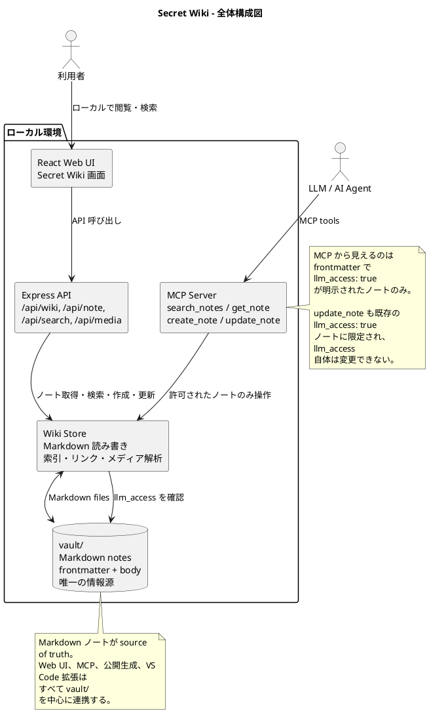

LLM-wikiというワードが話題になりつつあるが、もう全部混みでwikiにぶちこんで、LLMも人間も参照/書き込みできるようにしてしまえばいいじゃないか。という発想の元作成した。

::link-card[secret-wiki GitHub](https://github.com/mejirot/secret-wiki)

# 特徴

## LLM-wikiとしての機能

LLM-wikiとしての機能はローカルで使うこと前提。

LLMとのつながりはMCP.  
参照や書き込みができる。（あんまり、書き込みはテストしてないが）

基本的には人間が書く従来のwiki寄りの思想ではある。  
情報にノイズ増えるのはちょっと微妙では、という考え。

### アクセス権

といっても、なんでもかんでもLLMに見せるのは恥ずかしいので、アクセス権を導入した。  
llm_access: trueとすると、LLMがアクセスできるようになる。  
が、この辺はあんまりテストしてないので、ちゃんと動くか（設定しないときに見ないか）は怪しい。

## 普通のwikiとしての機能

今見ているように、普通のwikiとしても使える。  
が、全部コミットしてpushするのはオープンすぎるので、.gitignoreでコミットする物を制御してね。

