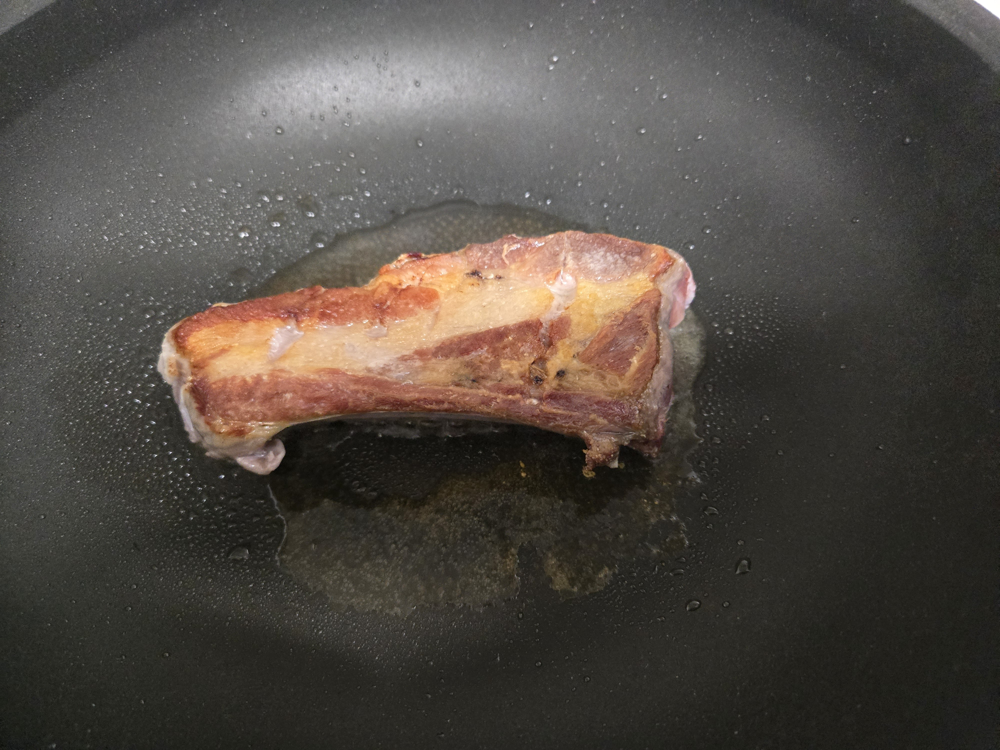
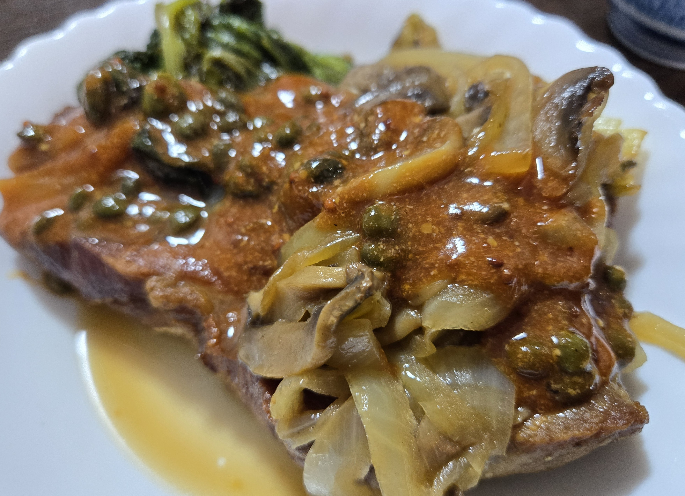

美味いんだが、見た目が美味そうに見えない料理。

https://www.youtube.com/watch?v=nBxC3yxOasQ

これをベースにめんどくさい要素（主にトマトの湯むき）を排除したレシピ。

# 材料

- 豚バラブロック
- 白菜 or レタス
  - どっちでもいい。冷蔵庫にある方を使うのがいい。
- 玉ねぎ 1/4
- マッシュルーム 2個
- トマトソース or (ケチャップ and 中濃ソース and 牛乳)
  - トマトソースがあればそれを使うのが楽だが、括弧内でも代用できなくはない。
- ケッパー
- 粒マスタード
- 白ワイン 150g
- バター　10gくらい
- 白胡椒　少々

# 手順

1. 白菜 or レタスをほどほどのサイズにカット
2. 玉ねぎとマッシュルームをスライス
3. 豚バラブロックをカットできるならカットして、まんべんなく塩を振る。  
骨付きだとカットできないので、火の通りをよくするために切り込みを入れておく程度でいい。  
煮込みフェーズがあるので、そこを調整すればいくらでも火を通せる。
4. 豚バラをしっかり美味しそうな焼き目がつくレベルで焼く。  

5. 豚バラをフライパンから取り出して、白菜 or レタスを塩少量で焼く。しっかり焼き色を付ける。水分があるとこの辺がうまくいかないので注意。
6. 白菜 or レタスを引き上げて、弱火でバター10g. 玉ねぎとマッシュルームを入れる。
7. 玉ねぎが飴色になったら白ワイン150g. 強火で一煮立ち。
8. 豚バラと白菜orレタスを戻して、蓋をして中火で3～5分。肉の厚さでこの時間は適当に変えるのがいい。
9. 蓋を取って、アロゼする。（フライパン内のだし汁？をスプーンで肉にかける動作）
10. 具材を取り出して、仕上げのソースづくりに入る。
11. ケッパーを好きなだけ入れる。  
トマトソース or (ケチャップ and 中濃ソース and 牛乳)をほどほどに入れる（この辺は勘）。カッコ内はだいたい1:1:1くらいでいいはず。  
粒マスタードを少な目に入れる。  
白胡椒少々。
温かくなるくらいまで熱する。
12. 盛り付ける。  
