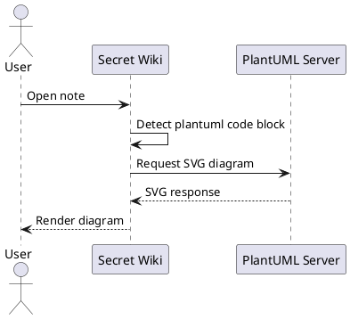
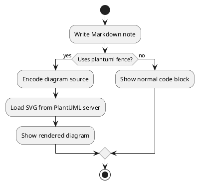
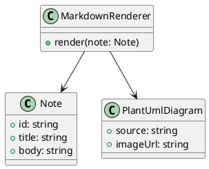

# PlantUML Sample

Secret Wiki renders fenced `plantuml` code blocks as diagrams. Use this page to confirm sequence, activity, and class diagrams in the reader.

## Sequence

## Activity

## Class

